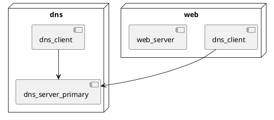
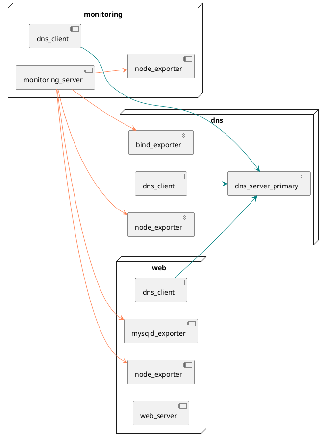

# PlantUML2Ansible

## Context

PlantUML2Ansible is a "work in progress" and proof-of-concept converter that converts network and deployment diagrams (created using PlantUML) to IaC and configuration management supported environments (provided by Vagrant & Ansible, respectively).

This solution is developed as part of a bachelor's thesis within the context of Applied IT at HOGENT (and its relevant course modules such as "[Cybersecurity Advanced](https://bamaflexweb.hogent.be/BMFUIDetailxOLOD.aspx?a=193610&b=5&c=1)" and "[Infrastructure Automation](https://bamaflexweb.hogent.be/BMFUIDetailxOLOD.aspx?a=193608&b=5&c=1)".

Further clarification on the motivation, research, and code behind this project can be found in [the thesis's repository](https://github.com/lucasluduenasegre/latex-hogent-bachproef-nl-25-26-luduenasegrelucas).

## Limitations

Since this project is a proof-of-concept, there are a number of noteworthy limitations (which will be elaborated upon further in the later sections):

1. Only a **single network** is supported when producing **both Vagrant and Ansible output** (**full mode**).
2. Multiple networks **are** supported for **Vagrant-only output** (**IaC-only mode**), with a maximum of defined **3** IP addresses per host.
3. An Ansible `control` node is automatically added in full mode; its IP address being the **network's broadcast address - 2**.
4. Only **IPv4** is supported.
5. All hosts defined in the diagrams are processed (denoted as "**managed**") unless the `managed = false` attribute is set in the network diagram.
6. Only **AlmaLinux 9** (bento/almalinux-9) is supported as the guest OS.

## Prerequisites & installation

- Git
- Python (tested on 3.11.2)
  - `pip` dependencies (see `requirements.txt`):
    - `jinja2`
    - `pyyaml`
- Vagrant (tested on 2.4.9)
- VirtualBox (tested on 7.2.6)

Ansible only runs on the `control` node VM and therefore does not have to be installed on the host machine.

To set up the converter, clone the repository, create a virtual Python environment, and install the Python dependencies:

```bash
git clone git@github.com:lucasluduenasegre/plantuml2ansible.git
cd plantuml2ansible
python -m venv .venv
source .venv/bin/activate # On Windows: .venv\Scripts\activate
pip install -r requirements.txt
```

## Basic examples

The following two sections will demonstrate a few basic examples of the usage of the script, as to give an idea of the output it can produce. The full input files and produced output files can be found in the `example/`-directory.

### Full mode (network + deployment diagram)

Example usage of the script for converting a **network diagram** and a corresponding **deployment diagram** to an **IaC (Vagrant) + configuration management (Ansible) supported environment** (limited to a single network):

```
python plantuml2ansible.py nwdiag_example_full_env.puml uml_example_full_env.puml
```

This provides the following output:

```
Generated vagrant-hosts: output/example_full_env/vagrant-hosts.yml
Generated inventory: output/example_full_env/ansible/inventory.yml
Generated playbook: output/example_full_env/ansible/site.yml
Generated host_vars: output/example_full_env/ansible/host_vars/dns.yml
Generated host_vars: output/example_full_env/ansible/host_vars/web.yml
Generated requirements: output/example_full_env/ansible/requirements.yml
Copied asset: output/example_full_env/Vagrantfile
Copied directory: output/example_full_env/scripts/
Copied role: output/example_full_env/ansible/roles/dns_server
Copied role: output/example_full_env/ansible/roles/web_server
Copied role: output/example_full_env/ansible/roles/dns_client
Copied asset: output/example_full_env/ansible/files/ca.crt
Copied asset: output/example_full_env/ansible/files/ca.key
Copied asset: output/example_full_env/ansible/files/db.sql
Copied asset: output/example_full_env/ansible/files/test.php
```

This output is produced based on the contents of these following two `.puml`-files (presented along with their rendered diagrams).

**`nwdiag_example_full_env.puml`**:
```plantuml
@startnwdiag example_full_env

network company.lan {
  address = "172.26.0.0/24"

  dns [address = "172.26.0.20"]
  web [address = "172.26.0.10"]
}

@endnwdiag
```


**`uml_example_full_env.puml`**:



### IaC-only mode (network diagram)

Second example for converting a **network diagram** to an **IaC-only supported environment with Vagrant** (with multiple managed networks):

```
python plantuml2ansible.py nwdiag_example_iac_env.puml 
```

This gives the following output:

```
Generated vagrant-hosts: output/example_iac_env/vagrant-hosts.yml
Copied asset: output/example_iac_env/Vagrantfile
```

<!--TODO-->

**`nwdiag_example_iac_env.puml`**:
```plantuml
@startnwdiag example_iac_env

network company.lan {
  address = "172.26.0.0/24"

  router [address = "172.26.0.254"]
  dns [address = "172.26.0.20"]
  web [address = "172.26.0.10"]
}

network external.lan {
  address = "172.26.10.0/24"

  router [address = "172.26.10.254"]
  workstation [address = "172.26.10.10"]
}

@endnwdiag
```


## Script usage

The next two sections will go into much further detail about the usage of this script, as well as elaborating on some of its limitations.

For both use cases, one can include the `--verbose`/`-v` flag for debugging purposes and specify the output directory with the `--output`/`-o` flag.

### Full mode (network + deployment diagram)

Command-line syntax:

```
python plantuml2ansible.py [--v | --verbose] [--nwdiag] <nwdiag_path> [--uml] <uml_path> [--role-config <role_config_path>] [[--output | -o] <output_path>]
```

This is the main use case of this script, and will set up a Vagrant environment as well as an Ansible-supported environment (including a `control` node) based on predefined roles assigned to the hosts. The `control` node's IP address will, by default, be the **network's broadcast address minus two**.

Only hosts/nodes within a **single network** can be defined in the deployment diagram for this use case. The configuration of routers (as well as the more elaborate firewall rules that it implies) is a task that goes beyond the scope of this proof-of-concept, which is to demonstrate the possibility of converting UML diagrams to configuration management code. As such, each VM will have internet access through their unique NAT interface, provided by Vagrant.

By default, the converter will use `role-config.yml` as the configuration file for predefined roles (which will be covered later). A custom role configuration file can optionally be provided with the `--role-config` flag.

The virtual machines in this environment will **only** use **AlmaLinux 9** (`bento/almalinux-9`) as their guest OS.
This is because the predefined roles for the converter are reliant on a number of **Bert Van Vreckem**'s Ansible roles (see the "Acknowledgements & Credits"-section), which are only functional on AlmaLinux 9 as opposed to the more recent AlmaLinux 10. 

### IaC-only mode (network diagram)

Command-line syntax:

```
python plantuml2ansible.py [--v | --verbose] [--nwdiag] <nwdiag_path> [[--output | -o] <output_path>]
```

This is useful if you wish to have a ready-to-use Vagrant environment, but you do want more freedom when setting up configuration management (with or without Ansible). To that end, this environment **will not** include a `control` node.

Multiple networks **can** be specified for this use case, as long as there are no hosts with more than **3** defined IP addresses. This is a technical limitation due to VirtualBox's maximum of 4 network interfaces, of which the first is reserved for the NAT interface Vagrant uses by default.

This is not the main use case of this script, but it does demonstrate the ability to handle multiple networks with Vagrant, which serves as a base for future extensions to this project.

## Input format (network + deployment diagrams)

The next three sections will describe the format of each of the three input files (network diagram, deployment diagram and role configuration file).

An **important note**, which might seem obvious, is that the converter assumes the provided PlantUML-based diagrams to be syntactically valid (and thus actually render images). The converter covers a lot of error handling in order to accurately produce the desired environment, but the responsibility for correct input mostly lies with the end user. Therefore, always try to render your `.puml`-files before proceeding with executing the script.

In PlantUML, single-line comments are denoted using `'` or `//` (with no preceding content) and multi-line comments using `/'` to start and `'/` to end.

### Network diagram (`@startnwdiag`)

The network diagram illustrates the logical topology of networks and hardware elements (in this case Vagrant VMs) in a given environment, along with their respective network/IP addresses. Optional attributes such as hardware specifications (amount of RAM and CPU cores) can also be provided here.

Multiple networks **can** be defined for IaC-only supported environments, as long as there are no hosts with more than **3** defined IP addresses.

Here follows an example of a possible network diagram:

```plantuml
@startnwdiag test_env
/'
Diagram name definition

Format: @startnwdiag <diagram_name>

Note: if no diagram name is specified, the filename is used as a fallback for
naming the output directory. This name should match the deployment diagram's.
'/

/'
Network definition

Format:
network <network_name> {
  address = <network_address>/<prefix_length>
  color = <color_value>
... 
}

Notes:
- Only IPv4 is supported when defining network addresses.
- "color" is an optional, visual attribute that will be rendered
  by PlantUML but ignored by the converter. See the following
  link for reading material on styling elements with colors:
    - https://plantuml.com/color
'/
network test.lan {
  address = "172.26.0.0/24"

  /'
  Host definition
  
  Format:
  <host_identifier> [address = <ipv4_address>, description = <description>, cpus = <amt_cores>, memory = <amt_gb_ram>, managed = <true|false>, shape = <shape>, color = <color_value>]
  
  Notes:
  - The only mandatory attribute is "address", all others are optional.
    Only IPv4 is supported when defining IP addresses.
  - By default the <description> attribute (which is rendered by PlantUML)
    will be used as the resulting hostname; <host_identifier> is the
    fallback if <description> is unused.
  - Underscores in the hostname will be converted to hyphens, due to 
    Unix conventions.
  - Hosts with the "managed = false" flag will be ignored by the converter
    but still rendered by PlantUML.
  - Like "color", "shape" is a purely visual attribute and will ignored by
    the converter. See the following link for reading material on styling
    elements with shapes (based on deployment diagram objects):
      - https://plantuml.com/deployment-diagram
  '/
  unmanaged_router [address = "172.26.0.254", managed = false, shape = node, color = LightSalmon]
  dns [description = "dns", address = "172.26.0.20", shape = node]
  monitoring [description = "monitoring", address = "172.26.0.30", cpus = 2, memory = 2048, shape = node]
  web [description = "web", address = "172.26.0.10", shape = node]
}

/'
Note: the following network is shown to demonstrate the possibility of defining
multiple networks, as well as unmanaged hosts. When generating both Vagrant and
Ansible code, the following hosts (and subsequently, the network) will not be
covered by the converter.
'/
network unmanaged.lan {
  address = "172.26.10.0/24"
  color = LightSalmon

  unmanaged_router [address = "172.26.10.254", managed = false, shape = node, color = LightSalmon]
  unmanaged_workstation [address = "172.26.10.128", managed = false, shape = node, color = LightSalmon]
}

@endnwdiag
```

The PlantUML code above will generate the following image:

![](https://www.plantuml.com/plantuml/svg/fLPHRzj637xNho3qaWH8vCJBjYBBWcuOXWt8kW9jjuTWC4uwshhbTAVTKNQDhVzzvCcAx4RfWXKeK9daVH-F_CZBoqWgaDjeerP066c1RftDZh8Vs11K0qur21gNnXaotcNPZpuqYgxWuEIrxiCN4dwJPQyyuHMO9JWFUX_9H8WjLcPfK9y2rGXBOt5mTH4rg0WAbihQKbNtiFGXOxTngnJjEsexOio05VcmBU1jRMAF7MlVMGsSNLMdO8sjzTi67Gr97CKYEvfbSi5NI1iVxgVkbhcTxthtqLyB_iu0bDO1OuHlH-VET3ExRWE3lLzOT2kgRpYwyjO7YKqVYxMo7PUdA0h8FlHLYbVP6Vpgx1P-Vhs-JFNfsjO7GWsR6bsVdrn_I6f7Xx7Wata2pkMSSk1RkOUofx0siLCM554mPKS8L2k2ZR4MIeI0JcD0dG6KMtXjbQDtlzm21u9PESyUiKi9A-_MoCc40juWzWtprleDPyIdhN6fHOoeD9ka-1WCCti7aRPMR6XHUX2Pdkg-97nh080pg8dQU3MRjP93rzYYyiqiXKYVXYkBC0kE-AW3-SNNysB-LN5UdC_cbtd6Jcuim4y-qdvV0VZVq5k0wvhz2wFHaUWmtC3TNbTDkxvyQEafmyGgc5HNyUxzP6VLTkcCQcXH-O1oeC66TJbOL-M2PITcvTGAjTWfTFWF2pmYssEjMXIhV8XXKZ9_z7VO2KOAzrQ6GMJ3m5gHK8xDDX7otHNoKr3MWgSQGmGLy44aXRJWMT9Z_xxgXFxxhNXLPqaqSLYNlKIEDxMfQe4U9BSlk9EKmI3AOVW5ZwaOMgYbLp9ztqoqpQHW0HdtXLaU9YD1dHFiFl5taaPCpGBZ4jb0iSja5Bq6yb1lsnfTP2LqAB-5Zb7C-pxC2KjV5D7Te7B1pSUUfsxdiBHgDR0yEMb2a4OnaaHE5QwdkpNtE2o0KyYJWFfD06qNq6uVRm7MIiy_aWlTVuxwimOz8HqEUyefmd6ffBdUJQnayEMVM54y4Lr_OYcC9yzs9pcUTmH0vtQ5NWJVSLPmDxKYvbzUSfK-QiauVyvh78VlrgngUgDiuvsCddOHxWutGSusnfjaEiyFSGM2aGpvm6LwX3IwdW3yWW67NJFVsp3pyyiNZvasM3wYODiJs1UFa_qWx-Fk2JzKmR2FJUGZVkDa7ZHo_f62ebuphO_HbCOQse9VFkoGh961RYqE897pYPoijVp_sCCqZR60tsK1hT0X0mjrwQc6twJlZaJ6sNUEQHYkaiOTvjbZmB6eFNPbnBywT6ItAMpWF-a7mNc24hFAht7osTjxXiOaF_4MNGoF4Ko9ANkcN2y-JwyZHQeqgQI3QPwB-Ol_noCwUObEzty2_Wi0)

### Deployment diagram (`@startuml`)

The deployment diagram represents the configuration of hosts (denoted here as "nodes"), their components (in this case predefined Ansible roles) and the connections between those components in a given environment. As mentioned before, only hosts within a **single network** can be defined in this diagram for **IaC + configuration management supported environments**.

The following is an example of a possible deployment diagram:



This code will render the following image:

![](https://www.plantuml.com/plantuml/svg/dLLDZzj63BtFho3IWrl0bk-RnI8jYZQ7jWY2xgaeZB66ieWTpMX9ZXsXo7-lASUhgEfX7Lz66lBnW-zHVYVgMKiNGL5qX-dejYltC_a3-mwIxn02DfH8AIVdVidSURs32NOVBhuxytrmxe-iU0VKGCeGlWv30j9ZJGrXM8Es20r5l9gAO00luA7nCUvz_GHDPdSsKpgCthbeNnG2CTQQUQZWpvRa4blQN6A0pclTZiu9zPJvwLh1IYgtsZfhxIC-5s8C42dXMtWkFbf90dNk-fmmwHXIu4GwnYA6thFTjraKA61IGx3x7gj31I59bNB07NxgCoio7CzWtCylVrX3ptWqR3fSYgvpZ2IKaxWcCt2EAA2jL_1zZvuX9-XALEeZZhalJGWg2FQUlMQ6ohaLV2YCSO0ZIV5n3QUSLWgjFoBuD00s3TPgqRH5wqMGNSH6GJCm7ThhK8rX6z7xB3fZtJYLExU1dmQxzoNgcNUKcgatZmSuKOomnnSQBHEZb3YsQyLRos_TlJtkfXa-08tE4-lKp4EFuaWMjt8RU4m1MUhCA42NXgx1NsgeSpeYAmRhhntw5fEi8HIqzyT4douUoS9BzQ9fPtp1ia0lyuAC0tCruituvdo-WN-S0m3OhiRZOuxplR7BQnvxdiHsRxml4ewNbuqoztFAEMfFARneQswpkdPr94pwFmP1FYBlUgREy_0VXvbYtMTtwRFBYJIp4MdjJg_MzIjJJw0l5RmcistHcF9ytf9haEUudCuYqy9c-QxbVHutmNZSQDuO7QQQTDaIkNxcVcJE9u6kY8AF9py8z9cIGiEvWzcEhM5V56gVJAAYGxH5gUlCmGQhsS7uQrLxkTjkQ_RIOkWeXUf0sfPzHNdx8VgaZx__zfwqRbjwGfPV2mNSHZ_aeb-EgjKkJhfUIBfQQcwpUO1N-9dsxNitpHusVtsdwEFVvm2ZPQanDv5_4_1ht48_1gypJ_ZvHjm47ILnEtIoVci4-vUOg_L6y3oliwlRg7c7APGk_Wi0)

### Role configuration (`role-config.yml`)

There are a number of predefined roles (found in `assets/ansible/roles`) that can be specified for each managed host in the deployment diagram. Much of the information required by each role (in the form of `host_vars`) will be derived from information gathered from both the network and deployment diagrams.

These roles (along with some roles coming directly from Ansible Galaxy) are defined in a configuration file called `role-config.yml` (found in the same directory as `plantuml2ansible.py`), which looks like this:

```yaml
# role-config.yml
# Maps simplified role identifiers (as used in deployment diagrams) to their
# fully qualified Ansible role names and associated metadata.
#
# Notes:
#   - "fqcn" (the "Fully Qualified Collection Name") is the name that will be used
#     in the roles section of a host's play in the playbook. This is also the only
#     required key, all others are optional.
#   - "priority" directs the execution order of the role within a host's play.
#     Roles with lower priority values run first, and 100 is the default value.
#   - "depends_on" directs which roles must be applied on other hosts before this
#     role's host play runs. For example, hosts with the "dns_server_*" role must
#     complete their play before the hosts with "dns_client".
#   - "galaxy_roles" and "galaxy_collections" represent the Ansible Galaxy roles
#     and collections that must be installed on the Ansible control node prior
#     to running the playbook.
#   - "assets" represent the files under the "assets/" directory that are to be
#     copied to the Ansible control node prior to running the playbook.
#   - "host_vars" are the variables (in YAML format) written to the host's 
#     host_vars file. Sentinels prefixed with __DIAGRAM_ are placeholders which 
#     will be resolved by the converter at build time, derived from
#     diagram information.
#
# Format:
# roles:
#   <role_identifier>:
#     fqcn: <fqcn>
#     priority: <priority>
#     depends_on:
#       - <role_identifier>
#       ...
#     galaxy_roles:
#       - <ansible_galaxy_role_name>
#     galaxy_collections:
#       - <ansible_galaxy_collection_name>
#     host_vars:
#       <host_vars_in_yaml_format>
#   ...   
---
roles:
  dhcp_server:
    fqcn: bertvv.dhcp
    priority: 10
    depends_on:
      - dns_server_primary
      - dns_server_secondary
    galaxy_roles:
      - bertvv.dhcp
    host_vars:
      rhbase_firewall_allow_services:
        - dhcp
      dhcp_global_default_lease_time: 14400
      dhcp_global_max_lease_time: 14400
      dhcp_global_domain_name: __DIAGRAM_NETWORK_NAME__
      dhcp_global_broadcast_address: __DIAGRAM_BROADCAST__
      dhcp_global_subnet_mask: __DIAGRAM_NETMASK__
      dhcp_global_domain_name_servers: __DIAGRAM_DNS_SERVER_IPS__
      dhcp_subnets: __DIAGRAM_SUBNETS__
  # Other roles below
```

## Available roles

The following sections will highlight the core functionality of each predefined role.

The title of each section will represent the **role identifier**, which is what will be specified after each `component`-keyword in the **deployment diagram** to assign the role to a host.

The **FQCN** (Fully Qualified Collection Name) is the name that will be used in the `roles` section of a host's play in the **Ansible playbook**.

### `dhcp_server`

**FQCN**: `bertvv.dhcp`

Configures an ISC DHCP server using the [`bertvv.dhcp`](https://galaxy.ansible.com/ui/standalone/roles/bertvv/dhcp/) Ansible Galaxy role. The subnet, broadcast address, netmask, domain name, and DNS server IPs are all derived automatically from the network diagram at build time. Default and maximum lease times are set to 4 hours (14400 seconds).

This role **depends on** `dns_server_primary` and/or `dns_server_secondary` being provisioned first, as their IP addresses are used to populate `dhcp_global_domain_name_servers`.

### `dns_server_primary` (BIND9)

**FQCN**: `dns_server`

Configures a primary authoritative DNS server using the [`bertvv.bind`](https://galaxy.ansible.com/ui/standalone/roles/bertvv/bind/) Ansible Galaxy role, wrapped in the custom `dns_server` role. The custom role additionally opens TCP port 8053 in SELinux (`dns_port_t`) to support the `bind_exporter`.

The zone definitions (forward and reverse) are generated automatically from the network diagram via the `__DIAGRAM_BIND_ZONES_PRIMARY__` sentinel. DNSSEC is disabled. Recursion is enabled, and queries are forwarded to `10.0.2.3` (Vagrant's internal DNS) and `1.1.1.1` as upstream resolvers. Zone transfers are restricted to the IPs of any secondary DNS servers defined in the diagram.

### `dns_server_secondary` (BIND9)

**FQCN**: `dns_server` (same as `dns_server_primary`, as it's virtually the same role with just different host_vars)

Configures a secondary DNS server using the same custom `dns_server` role as the primary. The zone definitions are populated via `__DIAGRAM_BIND_ZONES_SECONDARY__`, which generates secondary zone entries that transfer from the primary. DNSSEC and DNSSEC validation are both disabled, and the same upstream forwarders (`10.0.2.3`, `1.1.1.1`) are used.

### `dns_client`

A lightweight custom role that configures `/etc/resolv.conf` on managed hosts. It removes any pre-existing `nameserver` entries, sets the search domain to the network's domain name, and adds the DNS server IPs derived from the diagram (`__DIAGRAM_DNS_SERVER_IPS__`). It runs after both `dns_server_primary` and `dns_server_secondary` have been provisioned.

### `monitoring_server` (Grafana + Prometheus stack)

Deploys a monitoring stack consisting of [Prometheus](https://prometheus.io/) and [Grafana](https://grafana.com/) using the `prometheus.prometheus` and `grafana.grafana` Ansible Galaxy collections. The custom `monitoring_server` role applies both upstream roles in sequence, then copies the Grafana dashboard provisioning configuration and all dashboard JSON files from the Ansible control node to the server.

Grafana is pre-configured with Prometheus as a datasource (accessible at `http://localhost:9090`) and provisioning is set to synchronised mode, meaning dashboards are automatically loaded on startup. The admin credentials default to `admin` / `root`. Prometheus scrape targets are generated automatically from the diagram via `__DIAGRAM_SCRAPE_CONFIGS__`, which resolves to a list of jobs based on the exporter roles assigned to each host and their configured ports. Ports 3000/tcp (Grafana) and 53/tcp-udp are opened in the firewall.

### Prometheus exporters

Exporters are lightweight agents installed alongside their respective services. They expose metrics on a dedicated port, which the monitoring server's Prometheus instance scrapes. Each exporter role also ships a pre-built Grafana dashboard JSON file that is automatically copied to the monitoring server.

All exporters belong to the [`prometheus.prometheus`](https://galaxy.ansible.com/ui/namespaces/prometheus/) Ansible Galaxy collection and are assigned a priority of 50, meaning they run after the main service roles on the same host.

#### `apache_exporter`

**FQCN:** `prometheus.prometheus.apache_exporter` | **Port:** 9117/tcp

Exposes Apache HTTP server metrics by scraping the `mod_status` endpoint at `http://localhost/server-status/?auto`. Also sets `httpd_status_enable: true` to ensure the status module is active. Listens on `0.0.0.0:9117`.

#### `bind_exporter`

**FQCN:** `prometheus.prometheus.bind_exporter` | **Port:** 9119/tcp

Exposes BIND9 DNS server metrics. Requires `bind_statistics_channels: true` to be set (which this role enables) so that BIND exposes its internal statistics over HTTP for the exporter to read. Listens on port 9119.

#### `mysqld_exporter`

**FQCN:** `prometheus.prometheus.mysqld_exporter` | **Port:** 9104/tcp

Exposes MariaDB/MySQL metrics via a Unix socket (`/var/lib/mysql/mysql.sock`). Requires `python3-PyMySQL` to be installed (handled automatically). The following collectors are enabled: `info_schema.processlist`, `info_schema.innodb_metrics`, `info_schema.tablestats`, `info_schema.tables`, `info_schema.userstats`, `engine_innodb_status`, and `slave_status`. The `web_server` role automatically creates a dedicated `exporter` database user with the required `PROCESS`, `REPLICATION CLIENT`, and `SELECT` privileges.

#### `node_exporter`

**FQCN:** `prometheus.prometheus.node_exporter` | **Port:** 9100/tcp

Exposes general system-level metrics (CPU, memory, disk, network, etc.) for every host it is assigned to. This is typically the most broadly applied exporter role in any environment.

### `web_server` (Apache + MariaDB stack)

Configures an Apache HTTP server with TLS and a MariaDB database using the [`bertvv.httpd`](https://galaxy.ansible.com/ui/standalone/roles/bertvv/httpd/) Galaxy role, wrapped in the custom `web_server` role. The custom role additionally handles database provisioning and user creation via the `community.mysql` collection.

On first run (detected by whether the `db.sql` copy task registers a change), the role:
1. Copies `db.sql` to `/tmp/` on the server and imports it into the configured database.
2. Creates an application database user (`appuser` on `appdb` by default) with full privileges.
3. Creates a dedicated `exporter` user with read-only privileges for `mysqld_exporter`.

A PHP test script (`test.php`) is deployed to `/var/www/html/index.php`. TLS is configured using the `ca.crt` and `ca.key` files copied from `ansible/files/`. Both HTTP (80/tcp) and HTTPS (443/tcp) are opened in the firewall, and the `httpd_can_network_connect` SELinux boolean is enabled.

## Output structure<!-- in `<output_directory>/<diagram_name>/` -->

The following sections describe the file structure the converter will copy and generate, based on the employed use case.

### Network diagram only

Copied (verbatim):

- **`Vagrantfile`**
  - File that describes the general provisioning of each host managed by Vagrant. The hosts in this environment will **only** use **"bento/almalinux-9"** as the guest OS.

Generated (based on diagram):

- **`vagrant-hosts.yml`** (**without** `control`)
  - File that defines each managed host listed in the network diagram, their hostname, IP address(es), and hardware specifications. Hosts with **multiple** IP addresses **can** be defined here.

### Full mode (network + deployment diagram)

Copied (verbatim):

- **`Vagrantfile`**
- **`scripts/`**
  - Provisioning scripts (`scripts/control.sh` and `scripts/util.sh`) for the Ansible `control` node.
- **`ansible/roles/<role_name>/`** (for each defined role in the deployment diagram)
  - Predefined (custom) Ansible roles, which correspond to the FQCN of a role entry in `role-config.yml`.
- **`ansible/files/grafana/dashboards/<grafana_dashboard>.json`** (for each defined exporter role in the deployment diagram)
  - Monitoring dashboards to be provisioned for the Prometheus + Grafana monitoring stack (deployed using the role `monitoring_server`).
- **`ansible/files/ca.crt`** (when `role_web_server` is defined in the deployment diagram)
  - Custom, self-signed SSL certificate.
- **`ansible/files/ca.key`** (when `role_web_server` is defined in the deployment diagram)
  - SSL private key, used to generate and confirm the self-signed certificate.
- **`ansible/files/db.sql`** (when `role_web_server` is defined in the deployment diagram)
  - Very small, simple, and local MySQL database.
- **`ansible/files/test.php`** (when `role_web_server` is defined in the deployment diagram)
  - Simple PHP page that queries the aforementioned database.

Generated (based on diagrams):

- **`vagrant-hosts.yml`** (**including** `control`)
  - Only hosts with **single** IP addresses can be defined here.
- **`ansible/inventory.yml`**
  - Similar to `vagrant-hosts.yml`; defines each managed hosts (and corresponding IP addresses) listed in the network diagram, which will be configured by Ansible. Some Vagrant-specific variables are also defined here.
- **`ansible/site.yml`**
  - The main playbook of the Ansible environment, assigning the roles listed for each host (as defined in the deployment diagram), as well as general prerequisites for all hosts.
- **`ansible/requirements.yml`**
  - File describing the required roles and collections to be downloaded from Ansible Galaxy, mostly as dependencies for the predefined roles.
- **`ansible/host_vars/<hostname>.yml`** (for each defined host in the deployment diagram)
  - (Role-specific) variables for each managed host to be configured by Ansible, mainly derived from information in both diagrams (network/IP addresses, hostnames, asset paths, ...).

## Acknowledgements & Credits

### Ansible Galaxy roles & collections

- Bert Van Vreckem. (2015a). _bertvv/ansible-role-bind: Sets up ISC BIND as an authoritative DNS server on several Linux distros & FreeBSD_. GitHub. https://github.com/bertvv/ansible-role-bind
  - This was used for the custom role `role_dns_server`, which deploys a primary (and secondary) nameserver.

- Bert Van Vreckem. (2015b). _bertvv/ansible-role-dhcp: Ansible role for setting up ISC DHCPD on RHEL/CentOS 7_. GitHub. https://github.com/bertvv/ansible-role-dhcp
  - This was used for the custom role `role_dhcp_server`, which deploys a DHCP server.

- Bert Van Vreckem. (2015c). _bertvv/ansible-role-httpd: A simple Ansible role for installing and configuring the Apache web server for RHEL/CentOS 7 and Fedora 28_. GitHub. https://github.com/bertvv/ansible-role-httpd
  - This was used for the custom role `role_web_server`, which deploys a very simple Apache web server (including a small, built-in MariaDB database).

- Bert Van Vreckem. (2016). _bertvv/ansible-role-rh-base: Ansible role for basic setup of a server with a RedHat-based Linux distribution (CentOS, Fedora, RHEL, ...)_. GitHub. https://github.com/bertvv/ansible-role-rh-base
  - This was used for executing various basic configuration tasks (such as setting up the firewall and installing packages) on every VM (currently all running AlmaLinux 9).

- Grafana Labs. (2026). _grafana/grafana-ansible-collection: grafana.grafana Ansible collection provides modules and roles for managing various resources on Grafana Cloud and roles to manage and deploy Grafana Agent and Grafana_. GitHub. https://github.com/grafana/grafana-ansible-collection
  - This was used for the custom role `role_monitoring_server`, which deploys a Prometheus + Grafana monitoring stack.

- Prometheus Monitoring Community. (2026). _prometheus-community/ansible: Ansible Collection for Prometheus. GitHub_. https://github.com/prometheus-community/ansible
  - This was used for the custom role `role_monitoring_server` as well as the various exporters (node, MySQL, BIND).

### Grafana dashboards

- F., R. (2025). _rfmoz/grafana-dashboards: Grafana dashboards_. GitHub. https://github.com/rfmoz/grafana-dashboards
  - This was used for the Grafana dashboards for Apache Exporter (altered slightly), Bind Exporter, and Node Exporter.

- Grafana Labs. (2024). _MySQL Exporter Quickstart and Dashboard_. Grafana Labs. https://grafana.com/grafana/dashboards/14057-mysql/
  - This was used for the Grafana dashboard for MySQL Exporter.

### Other projects

- Bert Van Vreckem. (2025). _bertvv/ansible-skeleton: An opinionated skeleton for Ansible projects with a development environment powered by Vagrant_. GitHub. https://github.com/bertvv/ansible-skeleton
  - This was used to set up a local, Vagrant- and Ansible-ready virtual environment. A tailor-made version of this project (used in the HOGENT course module "[Infrastructure Automation](https://bamaflexweb.hogent.be/BMFUIDetailxOLOD.aspx?a=193608&b=5&c=1)") has been used and altered for the purposes of this proof-of-concept. Notably `Vagrantfile` has been changed to allow the creation of VMs with multiple network interfaces, and `scripts/control.sh` to automatically accept SSH host key fingerprints for each host in `vagrant-hosts.yml`.

- HoGentTIN. (2025a). _HoGentTIN/cybersecurity-advanced-lab-template: Cybersecurity Advanced - lab environment template_. GitHub. https://github.com/HoGentTIN/cybersecurity-advanced-lab-template
  - The network diagram for the lab template of this course module was used and slightly altered as input (without a corresponding deployment diagram) for this proof-of-concept.

- HoGentTIN. (2025b). _HoGentTIN/infra-labs: Lab assignments for the Infrastructure Automation course_. GitHub. https://github.com/HoGentTIN/infra-labs
  - The labs 2 and 3 of this course module were used as references for creating network- and deployment diagrams as input for this proof-of-concept (excluding `r001` and `srv003`).

## License

<!--TODO-->
