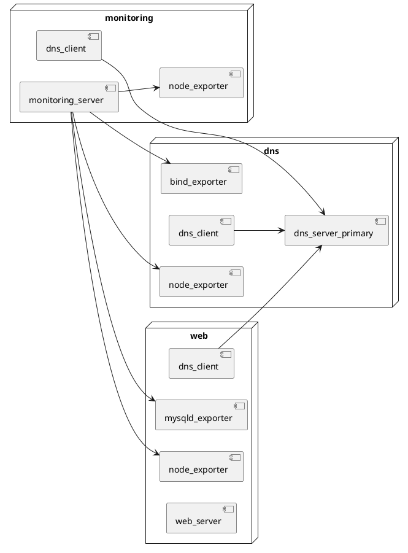

# PlantUML2Ansible

## Table of Contents

<!--TODO-->

## Context

PlantUML2Ansible is a "work in progress" and proof-of-concept converter that converts network and deployment diagrams (created using PlantUML) to IaC and configuration management supported environments (provided by Vagrant & Ansible, respectively). This solution is developed as part of a bachelor's thesis within the context of Applied IT at HOGENT (and its relevant course modules such as "[Cybersecurity Advanced](https://bamaflexweb.hogent.be/BMFUIDetailxOLOD.aspx?a=193610&b=5&c=1)" and "[Infrastructure Automation](https://bamaflexweb.hogent.be/BMFUIDetailxOLOD.aspx?a=193608&b=5&c=1)".

<!--TODO-->

## Limitations

Since this project is a proof-of-concept, there are a number of noteworthy limitations (which will be referred to again later, in the relevant sections):

1. Only hosts/nodes within a **single network** can be defined in the deployment diagram when generating **both Vagrant and Ansible code**. The configuration of routers (as well as the more elaborate firewall rules that it implies) is a task that goes beyond the scope of this proof-of-concept, which is to demonstrate the possibility of converting UML diagrams to configuration management code. As such, each VM will have internet access through their unique NAT interface, provided by Vagrant.
2. Multiple networks **can** be specified when **only generating Vagrant code** and as long as there are no hosts with more than **3** defined IP addresses. This is a technical limitation due to VirtualBox's maximum of 4 network interfaces, of which the first is reserved for the NAT interface Vagrant uses.
3. The resulting environment will be set up locally using Vagrant and will be configured using an Ansible `control` node VM. The host machine, therefore, does not require Ansible to be installed. The `control` node's IP address will, by default, be the broadcast address of the network minus two.
4. Only IPv4 is supported when defining the IP and network addresses.
5. The diagrams should only represent hosts that are to be managed by either the Vagrant or Ansible code, **unless** otherwise specified in the network diagram (`managed = false`).
6. The virtual machines in this environment will **only** use the **AlmaLinux** operating system, as the predefined roles for the converter are reliant on Ansible roles developed by Bert Van Vreckem. Additionally, since these roles were developed for a now deprecated version of Ansible, the Vagrant box to be used will be **"bento/almalinux-9"** instead of the more recent "bento/almalinux-10". This choice has obvious security implications for this environment, yet it is a compromise that had to be made for this proof-of-concept.

<!--TODO-->

## Prerequisites & Installation

- Git
- Python (tested on 3.11.2)
  - `pip` dependencies (see `requirements.txt`):
    - `jinja2`
    - `pyyaml`
- Vagrant (tested on 2.4.9)
- VirtualBox (tested on 7.2.6)

Ansible only runs on the `control` node VM and therefore does not have to be installed on the host machine.

To set up the converter, execute the following commands on your hostmachine's terminal:

```bash
git clone git@github.com:lucasluduenasegre/plantuml2ansible.git
cd plantuml2ansible
python3 -m venv .venv
source .venv/bin/activate # On Windows: .venv\Scripts\activate
pip install -r requirements.txt
```

## Installation

## Usage

<!--TODO-->

### Full mode (network + deployment diagram)

Converting a network diagram + corresponding deployment diagram (both in `.puml`) to an IaC (Vagrant) + configuration management (Ansible) supported environment:

```
python plantuml2ansible.py [--nwdiag] <nwdiag_path> [--uml] <uml_path> [--role-config <role_config_path>]
```

This is the main use case of this tool, and will set up a Vagrant environment as well as a rudimentary yet completely Ansible-supported environment (including a `control` node) based on predefined roles assigned to the hosts.

Only hosts/nodes within a **single network** can be defined in the deployment diagram for this use case. The configuration of routers (as well as the more elaborate firewall rules that it implies) is a task that goes beyond the scope of this proof-of-concept, which is to demonstrate the possibility of converting UML diagrams to configuration management code. As such, each VM will have internet access through their unique NAT interface, provided by Vagrant.

The `control` node's IP address will, by default, be the broadcast address of the network minus two.

By default, the converter will use `role-config.yml` (in the same directory as the script) as the configuration file for predefined roles (which will be covered later). A custom role configuration file can optionally be provided.

### Network diagram only

Converting a network diagram to an IaC-only supported environment with Vagrant:

```
python plantuml2ansible.py [--nwdiag] <nwdiag_path>
```

This is useful if you wish to have a ready-to-use Vagrant environment, but you do want more freedom when setting up configuration management (with or without Ansible). To that end, this environment **will not** include a `control` node.

Multiple networks **can** be specified for this use case, as long as there are no hosts with more than **3** defined IP addresses. This is a technical limitation due to VirtualBox's maximum of 4 network interfaces, of which the first is reserved for the NAT interface Vagrant uses.

This is not the main use case of this tool, but it does demonstrate the ability to handle multiple networks with Vagrant, and it serves as a base for future extensions to this project.

## Input format (network + deployment diagrams)

An **important note**, which might seem obvious, is that the converter assumes the provided PlantUML-based diagrams to be syntactically valid (and thus actually render images).
The converter covers a lot of error handling in order to accurately provide the desired
environment, but the responsibility for correct input mostly lies with the end user.
Therefore, always try to render your `.puml`-files before proceeding.

In PlantUML, single-line comments are denoted using `'` or `//` (with no preceding content) and multi-line comments using `/'` to start and `'/` to end.

### Network diagram (`@startnwdiag`)

The network diagram illustrates the logical topology of networks and hardware elements (in this case Vagrant VMs) in a given environment, along with their respective network and IP addresses.
Multiple networks **can** be defined for IaC-only supported environments, as long as there are no hosts with more than **3** defined IP addresses.

Here follows an example of a possible network diagram:

```plantuml
@startnwdiag test_env
/'
Diagram name definition

Format: @startnwdiag <diagram_name>

Note: if no diagram name is specified, the filename is used as a fallback for
naming the output directory. This name should match the deployment diagram's.
'/

/'
Network definition

Format: network <network_name> {
        ...
        }
'/
network test.lan {
  /'
  Subnet definition

  Format: address = <network-address>/<prefix-length>

  Note: Only IPv4 is supported when defining network addresses.
  '/
  address = "172.26.0.0/24"

  /'
  Host definition

  Format: <host_identifier> [address = <ipv4_address>, description = <description>, cpus = <amt_cores>, memory = <amt_gb_ram>, managed = <true|false>]

  Notes:
  - The only mandatory attribute is "address", all others are optional. Only IPv4
    is supported when defining IP addresses.
  - By default the <description> attribute will be used as the resulting hostname;
    <host_identifier> is the fallback if <description> is unused.
  - Underscores in the hostname will be converted to hyphens, due to Unix conventions.
  - Hosts with the "managed = false" flag will be rendered by PlantUML, but ignored
    by the converter.
  '/
  unmanaged_router [address = "172.26.0.254", managed = false]
  dns [description = "dns", address = "172.26.0.20"]
  monitoring [description = "monitoring", address = "172.26.0.30", cpus = 2, memory = 2048]
  web [description = "web", address = "172.26.0.10"]
}

/'
Note: the following network is shown to demonstrate the possibility of defining
multiple networks, as well as unmanaged hosts. When generating both Vagrant and
Ansible code, the following hosts (and subsequently, the network) will not be
covered by the converter.
'/
network unmanaged.lan {
  address = "172.26.10.0/24"

  unmanaged_router [address = "172.26.10.254", managed = false]
  unmanaged_workstation [address = "172.26.10.128", managed = false]
}

@endnwdiag
```

The PlantUML code above will generate the following image:


### Deployment diagram (`@startuml`)

The deployment diagram represents the configuration of hosts (denoted as nodes) and their components (in this case predefined Ansible roles). As mentioned before, only hosts/nodes within a **single network** can be defined in this diagram for IaC + configuration management supported environments.

The following is an example of a possible deployment diagram:



This code will render the following image:


### Role configuration

## Output structure<!-- in `<output_directory>/<diagram_name>/` -->

### Network diagram only

Copied (verbatim):

- `Vagrantfile`
  - File that describes the general provisioning of each host managed by Vagrant. The hosts in this environment will **only** use **"bento/almalinux-9"** as their base boxes.

Generated (based on diagram):

- `vagrant-hosts.yml` (**without** `control`)
  - File that defines each host, their hostname, IP address(es), and hardware specifications. Hosts with **multiple** IP addresses **can** be defined here.

<!--TODO-->

### Full mode (network + deployment diagram)

Copied (verbatim):

- **`Vagrantfile`**
- `scripts/`
  - Provisioning scripts for the Ansible `control` node.
- `ansible/roles/<role_name>/` (for each defined role in the deployment diagram)
  - Predefined (custom) Ansible roles, which correspond to the FQCN (Fully Qualified Collection Name) of a role entry in `role-config.yml`.
- `ansible/files/grafana/dashboards/<grafana_dashboard>.json` (for each defined exporter role in the deployment diagram)
  - Monitoring dashboards to be provisioned for the Prometheus + Grafana monitoring stack (deployed using the role `monitoring_server`).
- `ansible/files/db.sql` (when `role_web_server` is defined in the deployment diagram)
  - Very small and simple MySQL database.
- `ansible/files/test.php` (when `role_web_server` is defined in the deployment diagram)
  - Simple PHP page that queries the afforementioned (local) database.

Generated (based on diagrams):

- `vagrant-hosts.yml` (**including** `control`)
- Inventory file (`ansible/inventory.yml`)
  - Similar to `vagrant-hosts.yml`; defines the managed hosts (and corresponding IP addresses) which will be configured by Ansible.
- `ansible/site.yml`
  - The main playbook of the Ansible environment, assigning each role per host (as defined on the deployment diagram), as well as general prerequisites for all hosts.
- `ansible/host_vars/<hostname>.yml` (for each defined host in the deployment diagram)
  - Variables (mostly) derived from information on the deployment diagram for configuring the roles on each defined host.
- `ansible/requirements.yml`
  - File describing the required roles and collections to be downloaded from Ansible Galaxy, mostly as dependencies for the predefined roles.

<!--TODO-->

## Acknowledgements & Credits

### Ansible Galaxy roles & collections

- Bert Van Vreckem. (2015a). _bertvv/ansible-role-bind: Sets up ISC BIND as an authoritative DNS server on several Linux distros & FreeBSD_. GitHub. https://github.com/bertvv/ansible-role-bind
  - This was used for the custom role `role_dns_server`, which deploys a primary (and secondary) nameserver.

- Bert Van Vreckem. (2015b). _bertvv/ansible-role-dhcp: Ansible role for setting up ISC DHCPD on RHEL/CentOS 7_. GitHub. https://github.com/bertvv/ansible-role-dhcp
  - This was used for the custom role `role_dhcp_server`, which deploys a DHCP server.

- Bert Van Vreckem. (2015c). _bertvv/ansible-role-httpd: A simple Ansible role for installing and configuring the Apache web server for RHEL/CentOS 7 and Fedora 28_. GitHub. https://github.com/bertvv/ansible-role-httpd
  - This was used for the custom role `role_web_server`, which deploys a very simple Apache web server (including a small, built-in MariaDB database).

- Bert Van Vreckem. (2016). _bertvv/ansible-role-rh-base: Ansible role for basic setup of a server with a RedHat-based Linux distribution (CentOS, Fedora, RHEL, ...)_. GitHub. https://github.com/bertvv/ansible-role-rh-base
  - This was used for executing various basic configuration tasks (such as setting up the firewall and installing packages) on every VM (currently all running AlmaLinux 9).

- Grafana Labs. (2026). _grafana/grafana-ansible-collection: grafana.grafana Ansible collection provides modules and roles for managing various resources on Grafana Cloud and roles to manage and deploy Grafana Agent and Grafana_. GitHub. https://github.com/grafana/grafana-ansible-collection
  - This was used for the custom role `role_monitoring_server`, which deploys a Prometheus + Grafana monitoring stack.

- Prometheus Monitoring Community. (2026). _prometheus-community/ansible: Ansible Collection for Prometheus. GitHub_. https://github.com/prometheus-community/ansible
  - This was used for the custom role `role_monitoring_server` as well as the various exporters (node, MySQL, BIND).

### Grafana dashboards

- F., R. (2025). _rfmoz/grafana-dashboards: Grafana dashboards_. GitHub. https://github.com/rfmoz/grafana-dashboards
  - This was used for the Grafana dashboards for Apache Exporter (altered slightly), Bind Exporter, and Node Exporter.

- Grafana Labs. (2024). _MySQL Exporter Quickstart and Dashboard_. Grafana Labs. https://grafana.com/grafana/dashboards/14057-mysql/
  - This was used for the Grafana dashboard for MySQL Exporter.

### Other projects

- Bert Van Vreckem. (2025). _bertvv/ansible-skeleton: An opinionated skeleton for Ansible projects with a development environment powered by Vagrant_. GitHub. https://github.com/bertvv/ansible-skeleton
  - This was used to set up a local, Vagrant- and Ansible-ready virtual environment. A tailor-made version of this project (used in the HOGENT course module "[Infrastructure Automation](https://bamaflexweb.hogent.be/BMFUIDetailxOLOD.aspx?a=193608&b=5&c=1)") has been used and altered for the purposes of this proof-of-concept. Notably `Vagrantfile` has been changed to allow the creation of VMs with multiple network interfaces, and `scripts/control.sh` to automatically accept SSH host key fingerprints for each host in `vagrant-hosts.yml`.

- HoGentTIN. (2025a). _HoGentTIN/cybersecurity-advanced-lab-template: Cybersecurity Advanced - lab environment template_. GitHub. https://github.com/HoGentTIN/cybersecurity-advanced-lab-template
  - The network diagram for the lab template of this course module was used and slightly altered as input (without a corresponding deployment diagram) for this proof-of-concept.

- HoGentTIN. (2025b). _HoGentTIN/infra-labs: Lab assignments for the Infrastructure Automation course_. GitHub. https://github.com/HoGentTIN/infra-labs
  - The labs 2 and 3 of this course module were used as references for creating network- and deployment diagrams as input for this proof-of-concept (excluding `r001` and `srv003`).

## License

<!--TODO-->
